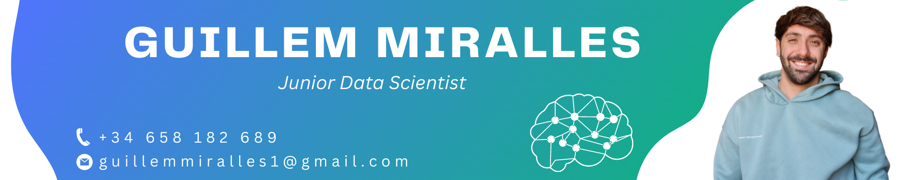

👋 Hi! My name is Guillem Miralles, and I'm a passionate data scientist and AI enthusiast. 📚🧠

I have a degree in **Data Science** 📊 and a master's degree in **Artificial Intelligence** 🤖 from **University of Valencia.** 🎓 

Welcome to my vibrant portfolio, where I showcase some of my diverse projects and their exciting results. 💼✨

Explore the intersection between data and creativity through my data visualizations 📊, predictive modeling 📈 and cutting-edge AI applications. 🌟
  
  
# [Project 1 (Python) - Field Wizard: Predicting Positions and Formations for Success on the Soccer Field.](https://github.com/GuillemMiralles/Authomatic-Machine-Learning-Class) ⚽🧐🔥

## Objectives
In this project, we sought to accomplish the following objectives using **Deep Learning techniques**:

1. **Predict possible player positions** on a soccer field based on their attributes.
2. **Predict the optimal team formation** for a team given the attributes of its players and the attributes of its opponents.

Throughout the course of this project, we utilized multiple dataframes and undertook a significant amount of data adaptation work. This included a comprehensive **Exploratory Data Analysis (EDA)**, which helped us gain insights into the data and inform our modeling process.

## Why this?
- The first project is interesting for its potential applications in player development, talent identification, strategic planning and injury management. It demonstrates the power of AI in sports analysis and decision making.  
- The second objective is intriguing for its potential to revolutionize strategic decision making in soccer. This model could help coaches design effective game plans, taking into account the strengths of their team and the specific challenges posed by opponents. It could also be valuable in dynamic situations, such as responding to player injuries or suspensions.

## Results

The results were impressive. Below is a summary of our findings:

| Task | Accuracy | F1-Score |
| --- | --- | --- |
| Predicting Player Positions | 0.97 | 0.99 |
| Predicting Optimal Team Formation | 0.783 | 0.782 |
  
  
# [Project 2 (Python) - DeepLearning Lyrics: Composing songs with the AI based on my favorite bands.](https://github.com/GuillemMiralles/Authomatic-Machine-Learning-Class) 🎶🎤🎸

## Objectives
In this project, we seek to accomplish the goal of **Generating song lyrics** based on scraped data from favorite music bands.

Throughout the project, we employed web scraping to collect song lyrics and developed a Deep Learning model using PyTorch to generate new lyrics based on the collected data.

## Why this?
- This project is interesting because of its potential for creative applications in the music industry. It showcases the capabilities of AI to generate unique and personalized lyrics. In addition, it allows exploring the intersection between technology and artistic expression.

## Results

The results obtained with this project were remarkable. Here is a summary of the results:
  
  
# [Project 3 (Python)  - News Categorizer: NLP's Quest to Sort Meneame.net News.](https://github.com/GuillemMiralles/Meneame_News_Classifier/tree/main) 📰🏷🕶
## Objectives
In this previous project, we sought to accomplish the following objective using **NLP (Natural Language Processing) techniques** to **Classify the type of news** in the meneame.net database.

## Why this?
- This project was intriguing due to its potential for various applications, such as improving news organization, content recommendation, and understanding user preferences. It showcased the power of NLP in handling large volumes of text data and extracting valuable insights.

## Results

The results of this project were significant and provided valuable insights into the classification of news articles. Here's a summary of our findings:

| Task | F1 | Leisure F1 |
| --- | --- | --- |
| Logistic Regression with TF-IDF | 0.7761 | 0.88 |
| SGDClassifier with Bag Of Words | 0.7768 | 0.88 |
| SVC with Doc2Bow | 0.7699 | 0.53 |
  
### [The Complete Article in Medium](https://guillemmiralles1.medium.com/news-classification-unbalanced-classes-nlp-e865ac33eb85)📜
  
# [Project 4 (RStudio) - Deep in the Depths of Sleep: Creating Interpretable Models to Detect Sleep Phases Using Polysomnography Signals from Patients.](https://github.com/GuillemMiralles/Authomatic-Machine-Learning-Class) 🛌💤🔍

## Objectives
In this project, we try to **classify sleep stages** based on PSG signals using **Interpretable Machine Learning techniques**. Throughout the project, we employed interpretability-focused machine learning models to analyze PSG signals and accurately identify the different phases of REM sleep.

## Why this?
- Classifying sleep stages based on PSG signals using interpretable machine learning techniques is useful for medical diagnosis and treatment of sleep disorders, monitoring sleep quality, providing personalized sleep recommendations, advancing sleep research, and enhancing sleep tracking with wearable devices. Interpretable machine learning models help identify relevant PSG features and their relationships to sleep stages, empowering individuals to understand their sleep patterns and make informed decisions for improved sleep health.

## Results

The results obtained from this project were significant and demonstrated the efficacy of the interpretability-focused machine learning models. Here's a summary of our findings:

| Task | Accuracy | Interpretability Score |
| --- | --- | --- |
| Logistic Regression with TF-IDF | 0.7761 | 0.88 |
| SGDClassifier with Bag Of Words | 0.7768 | 0.88 |
| SVC with Doc2Bow | 0.7699 | 0.53 |

  
# [Project 5 (RStudio)  - Data Dunk in the NBA: A Shiny Dashboard of Advanced Metrics and NBA Predictions.](https://github.com/GuillemMiralles/Shiny-NBA-App) 🏀📊👁‍🗨
## Objectives
The purpose of this dashboard is to view advanced NBA statistics and prediction models. The user can interact by selecting season, team, players ... 

We have:
- Tables with statistics of teams and players given the season that the user indicates.
- Advanced statistics of teams, players and players' shooting.
- Prediction on which players will be in the ALL-NBA Team.
- Evolution of the average salary in the NBA.

## Why this?
- This project could serve as a template for a more comprehensive NBA statistics dashboard. It offers numerous possibilities for expanding both the range of statistics and the models used. By enhancing the dashboard, we can explore a wider array of statistical insights. Moreover, we have the opportunity to develop new models that can predict future game outcomes, championship results, and more. Additionally, there is room for improvement in the All-NBA Team model, as it currently relies on linear models.

## Results
### [Shiny Dashboard](https://guillemmiralles.shinyapps.io/5_42/)

